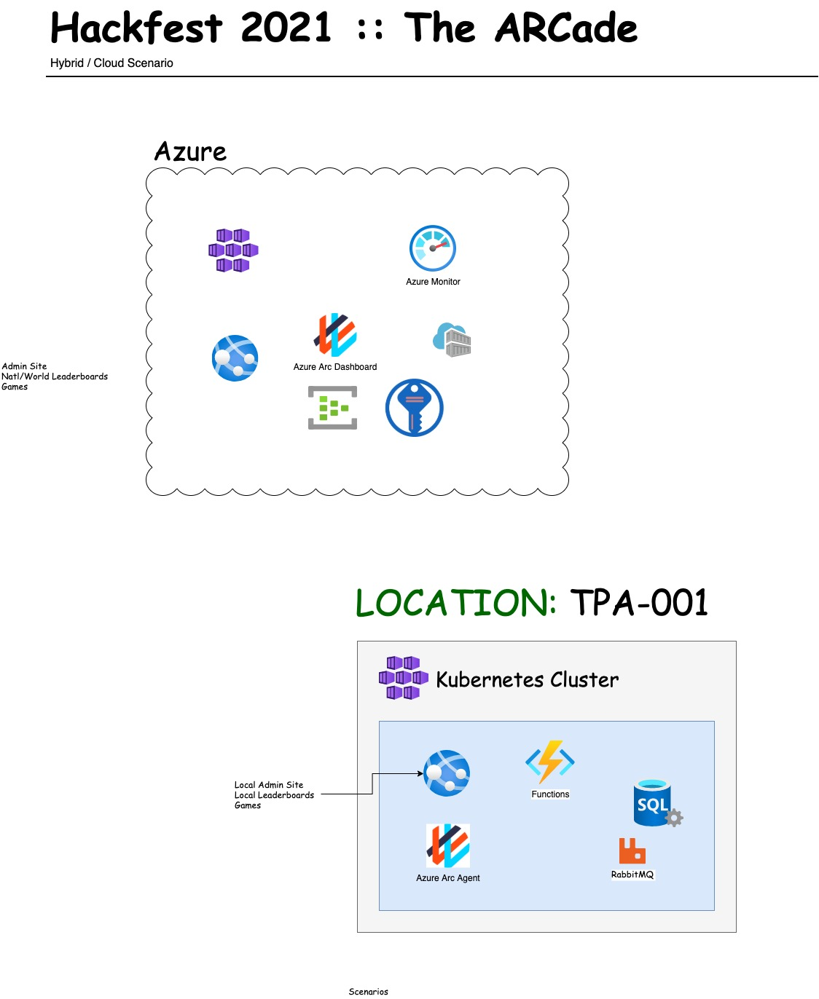

## Demo/Workshop App (Project code named "Retro Arcade")

### Background

This demo/workshop is being created to help show the value of the Microsoft hybrid cloud native story. This includes Azure Arc for Kubernetes, AKS, and the overall value of the Azure PaaS story.

The business scenario is a Retail operation with extensive applications that must run in a branch office. These branches can run in Azure or in local compute with limited bandwidth. 

This is a work in progress.

### Contents

There will be an associated app with source code forked from the GBB Dapr Workshop.

It will also include:

* Infrastructure templates
* Application config (YAML)
* Policies
* Supporting docs

### Work Items 

Initial project. https://github.com/Azure/retro-arcade/projects/1 

### Architecture Diagram

